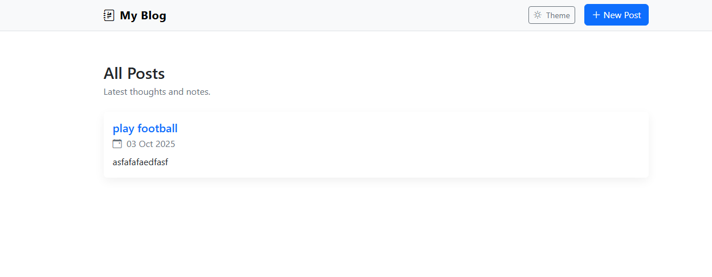
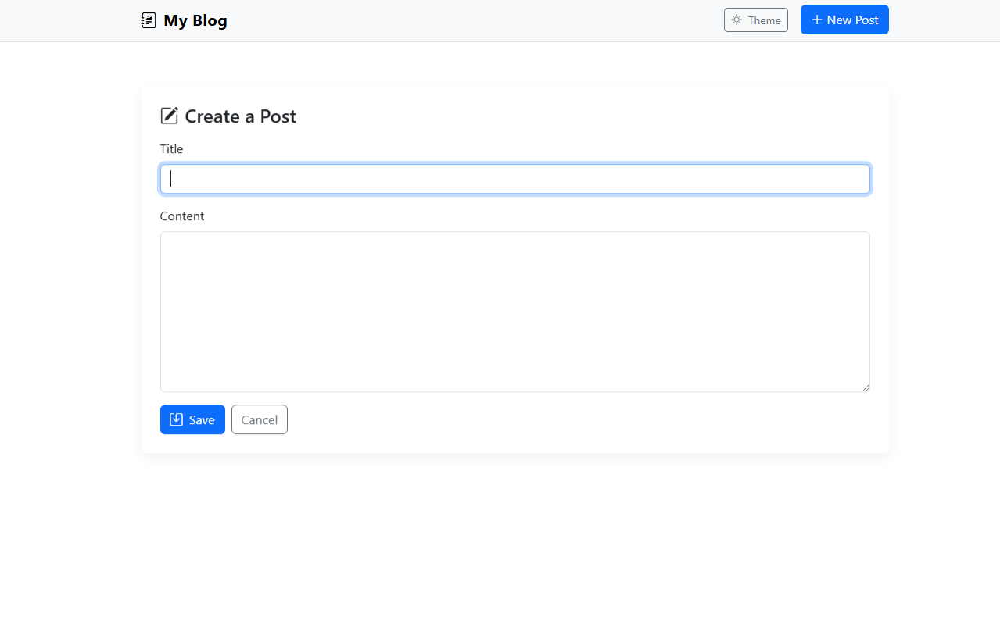

# 📖 My Blog – Laravel Project

A simple personal blog built with the **Laravel Framework**.  
This project allows users to create, view, and read blog posts in a clean UI.  
It demonstrates Laravel basics such as **routing, controllers, models, migrations, and Blade templates**.

---

## 🚀 Features
- Create new posts (title + content)
- View all posts
- View a single post with publication date
- Flash messages after actions
- Simple, responsive UI (Bootstrap 5)
- Dark/Light theme toggle

---

## ⚙️ Requirements
- PHP 8.1+  
- Composer  
- MySQL / MariaDB  
- Laravel 12.x  

---

## 🛠️ Installation & Setup

1. **Clone Repository**
   ```bash
   git clone https://github.com/Basta97/my-blog.git
   cd my-blog
   ```

2. **Install Dependencies**
   ```bash
   composer install
   npm install && npm run dev
   ```

3. **Environment Setup**
   - Copy `.env.example` to `.env`
   - Update your database credentials:
     ```env
     DB_DATABASE=my_blog
     DB_USERNAME=root
     DB_PASSWORD=yourpassword
     ```

4. **Run Migrations**
   ```bash
   php artisan migrate
   ```

5. **Import Sample Data** (optional)
   ```bash
   mysql -u root -p my_blog < my_blog.sql
   ```

6. **Start the Server**
   ```bash
   php artisan serve
   ```

7. Open in browser:  
   👉 [http://127.0.0.1:8000/posts](http://127.0.0.1:8000/posts)

---

## 📷 Screenshots

### 🏠 Posts Index


### ➕ Create Post


### 📄 Show Post


*(Place your screenshots inside a `/screenshots/` folder and update these links.)*

---

## 📂 Project Structure
```
my-blog/
├── app/
│   ├── Http/Controllers/PostController.php
│   └── Models/Post.php
├── database/
│   └── migrations/xxxx_create_posts_table.php
├── resources/
│   └── views/
│       ├── layouts/app.blade.php
│       └── posts/index.blade.php
│       └── posts/create.blade.php
│       └── posts/show.blade.php
├── routes/web.php
├── README.md
├── my_blog.sql
```

---

## 📝 Author
- **Ahmed Mohamed**  
  📧 [ahmed.b.01.12.97@gmail.com](mailto:ahmed.b.01.12.97@gmail.com)  
  🌐 [GitHub](https://github.com/Basta97)  
  🔗 [LinkedIn](https://www.linkedin.com/in/ahmed-elbastawisi-709069266)

---
